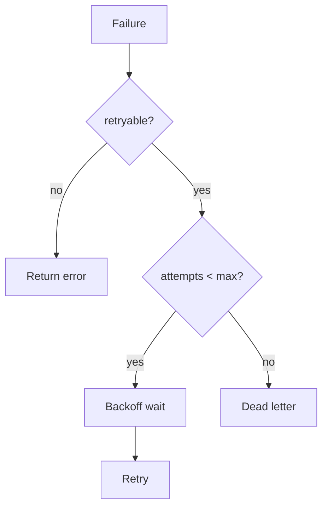

# 20 — Universal Failure Model

**Status:** Official SSOT · **Version:** 1.0.0 · **Decision:** D-UP-20

---

## Failure taxonomy

| Class | Response | Retry |
|-------|----------|-------|
| Validation | error 400 | No |
| Authorization | error 403 | No |
| Not found | error 404 | No |
| Conflict | error 409 | Conditional |
| Transient | error 503 | Yes |
| Timeout | error 504 | Yes |
| Circuit open | error 503 | After cooldown |

---

## Timeout hierarchy

| Layer | Default |
|-------|---------|
| HTTP request | 30s |
| Handler | 30s (configurable) |
| External connector | 15s |
| Publish compile | 300s (async) |
| Job | handler timeout + 5s grace |

---

## Retry policy

| Context | max | Backoff |
|---------|-----|---------|
| Client HTTP | 3 | 1s, 4s, 16s |
| Event consumer | 3 | 1s, 4s, 16s |
| Connector | 2 | 1s, 4s |
| Pipeline | 0 | — |

---

## Circuit breaker

| State | Behavior |
|-------|----------|
| Closed | Normal |
| Open | Fail fast 503 |
| Half-open | Probe 3 calls |

Threshold: 5 failures / 30s — [platform-behavior/24](../platform-behavior/24-CROSS-CUTTING-CONCERNS.md).

---

## Fallback

| Scenario | Fallback |
|----------|----------|
| Redis down | DB direct — degraded |
| AI provider down | Error + manual path |
| External ERP down | Queue for retry |
| CRB invalid | Maintenance screen — no stale serve |

**Never** silent fallback that bypasses authorization.

---

## Graceful degradation

| Component | Degraded mode |
|-----------|---------------|
| Cache | Slower reads |
| L10 Intelligence | Disabled — core ERP works |
| AI assist | Hidden — manual works |
| Read replica lag | Strong read for writes |

---

*End of document.*
