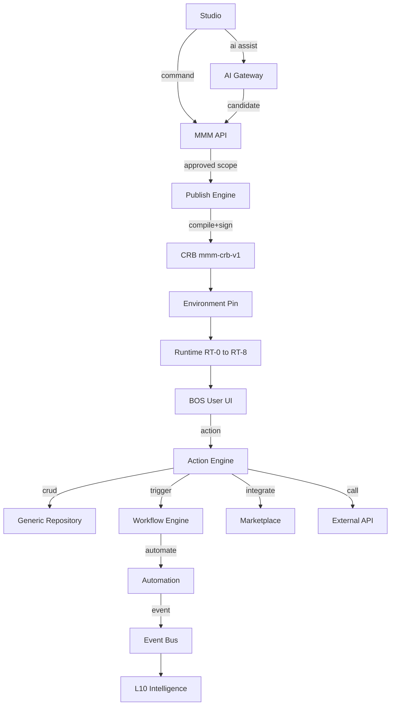
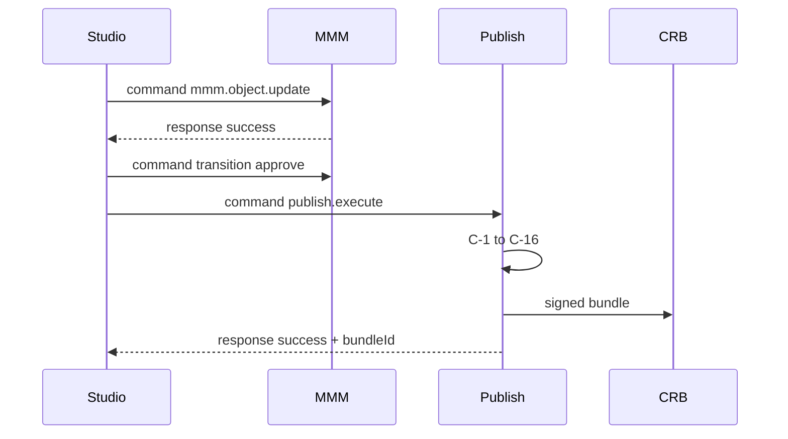
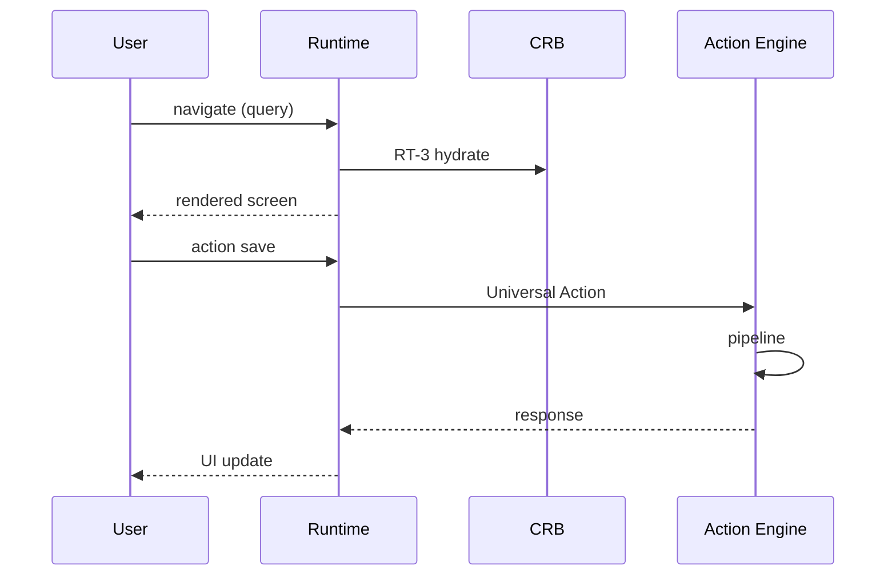
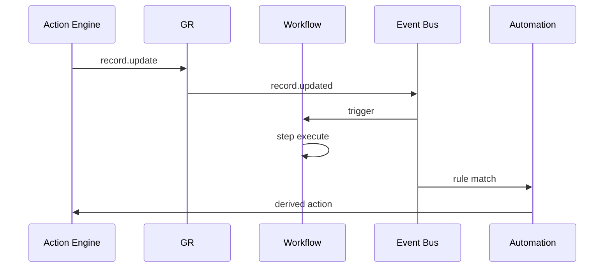
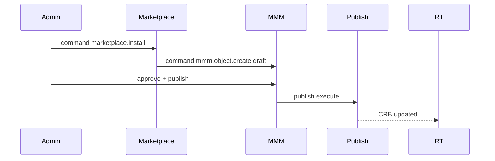
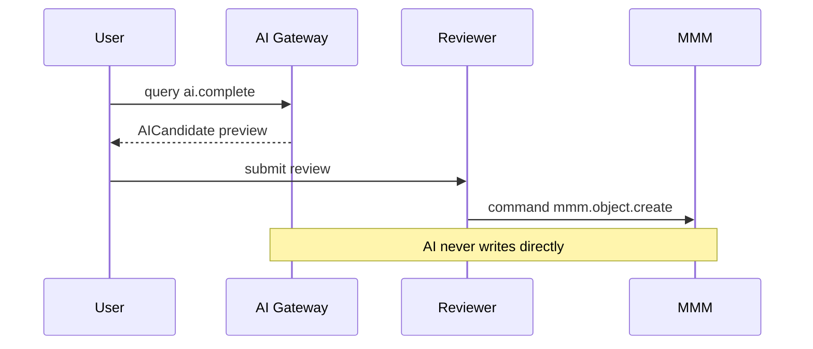

# 21 — Universal Execution Sequence

**Status:** Official SSOT · **Version:** 1.0.0 · **Decision:** D-UP-21

---

## Master sequence

---

## Studio → Publish

---

## CRB → Runtime → User

---

## Action → Workflow → Automation

---

## Marketplace install

---

## AI path (bounded)

---

*End of document.*
