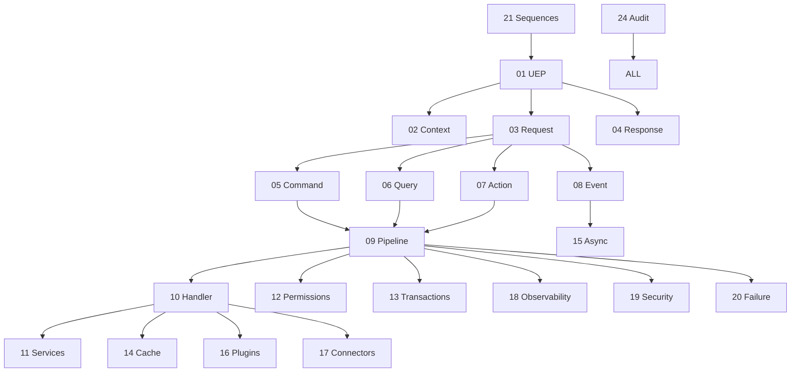

# 22 — Universal Contract Map

**Status:** Official SSOT · **Version:** 1.0.0 · **Decision:** D-UP-22

---

## Contract dependency graph

---

## Layer contracts

| From | To | Contract doc | Message types |
|------|-----|--------------|---------------|
| Studio | MMM | 05 Command | command |
| BOS | Runtime | 07 Action, 06 Query | action, query |
| Runtime | GR | 05 Command, 06 Query | command, query |
| Publish | CRB | 05 Command | internal |
| Any | Event Bus | 08 Event | event |
| AI Gateway | MMM | 05 Command | ai.candidate.create |
| Marketplace | MMM | 05 Command | marketplace.install |
| External | API | 03 Request | command, query |

---

## Must never

| From | To | Reason |
|------|-----|--------|
| Runtime | MMM DB direct | D-PA-03 |
| AI | MMM write direct | D-PB-07 |
| Handler | Permission bypass | D-UP-12 |
| Event | Pre-commit publish | D-PB-11 |
| Client | CRB unsigned | D-PA-03 |

---

## SSOT cross-reference

| Topic | Authority |
|-------|-----------|
| Wire protocol | platform-protocol (this folder) |
| Operational behavior | platform-behavior |
| Topology | platform-architecture |
| MMM taxonomy | meta-model |

---

## Initialization order

| Order | Component |
|-------|-----------|
| 1 | L0 Infrastructure |
| 2 | L1 USR + Pipeline |
| 3 | MMM read services |
| 4 | Runtime bridge ready |
| 5 | Accept UEP requests |

---

*End of document.*
