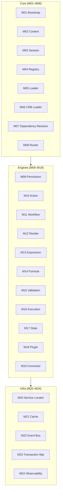

# 01 — Runtime Backlog

**Foundation C.0** · Módulos do Runtime MAK (decomposição executável)

---

## 1. Princípio

Cada linha abaixo é um **módulo implementável** com interface pública, contratos, critérios de done e gate **G423-NN**. Nenhum módulo inventa arquitetura — deriva de [02-RUNTIME](../platform-architecture/02-RUNTIME.md), [07-RUNTIME-LIFECYCLE](../platform-behavior/07-RUNTIME-LIFECYCLE.md), [09-UNIVERSAL-PIPELINE](../platform-protocol/09-UNIVERSAL-PIPELINE.md).

---

## 2. Tabela mestre

| ID | Módulo | Camada | SSOT primário | Gate | Entrega |
|----|--------|--------|---------------|------|---------|
| M01 | **Bootstrap** | Core | PA-02 RT-0..RT-8 | G423-01 | C.1 |
| M02 | **Context** | Core | PA-02 §3 | G423-02 | C.1 |
| M03 | **Session** | Core | PA-02 §3, PB-07 | G423-03 | C.2 |
| M04 | **Registry** | Core | PA-02 §3, PA-03 | G423-04 | C.2 |
| M05 | **Loader** | Core | PA-02 §3 | G423-05 | C.3 |
| M06 | **CRB Loader** | Core | PA-02 §4, PA-03 | G423-06 | C.3 |
| M07 | **Dependency Resolver** | Core | PA-02 §3 | G423-07 | C.4 |
| M08 | **Router** | Core | PA-02 §3, PA-04 | G423-08 | C.4 |
| M09 | **Permission Engine** | Engine | PA-02 §3, PA-05 | G423-09 | C.5 |
| M10 | **Action Engine** | Engine | PA-02 §3, PB-04, UP-07 | G423-10 | C.6 |
| M11 | **Workflow Engine** | Engine | PA-02 §3, PB-05, UP-08 | G423-11 | C.7 |
| M12 | **Render Engine** | Engine | PA-07, PA-02 §3 | G423-12 | C.8 |
| M13 | **Expression Engine** | Engine | PA-02 §3, MMM | G423-13 | C.9 |
| M14 | **Formula Engine** | Engine | PA-02 §3, MMM | G423-14 | C.9 |
| M15 | **Validation Engine** | Engine | PA-02 §3, PB-03 | G423-15 | C.10 |
| M16 | **Execution Engine** | Engine | UP-09, UP-10 | G423-16 | C.11 |
| M17 | **State Engine** | Engine | PB-02, PB-07 | G423-17 | C.12 |
| M18 | **Plugin Engine** | Engine | PA-02 §3, PA-09 | G423-18 | C.13 |
| M19 | **Connector Engine** | Engine | UP-11, UP-12 | G423-19 | C.14 |
| M20 | **Service Locator** | Infra | PA-02 §3 | G423-20 | C.5 |
| M21 | **Cache** | Infra | PA-02 §3 | G423-21 | C.15 |
| M22 | **Event Bus** | Infra | UP-06, PB-06 | G423-22 | C.15 |
| M23 | **Transaction Manager** | Infra | UP-09 §5 | G423-23 | C.16 |
| M24 | **Observability** | Infra | PA-02 §3, UP-24 | G423-24 | C.17 |
| — | **Scheduler** | Infra | PA-02 §3 | — | Foundation F |
| — | **Background Jobs** | Infra | PA-02 §3 | — | Foundation F |
| — | **Health** | Infra | UP-24 | — | C.17 (subset) |
| — | **Diagnostics** | Infra | UP-24 | — | C.17 (subset) |
| — | **Localization** | Infra | MMM | — | Foundation H |
| — | **Feature Flags** | Infra | PA-02 §3 | — | Foundation I |
| — | **Storage Adapter** | Infra | PA-02 §3 | — | Foundation G |

**Nota:** Scheduler, Background Jobs, Localization, Feature Flags, Storage Adapter estão no backlog arquitetural ([PA-02](../platform-architecture/02-RUNTIME.md)) mas **fora do escopo mínimo Foundation C** — implementados em foundations posteriores (F, G, H, I).

---

## 3. Detalhamento por módulo

### M01 — Bootstrap

**Responsabilidade:** Orquestrar RT-0 → RT-8; expor `bootstrap()` / `hydrate()` / `destroy()`.

**Entradas:** Config host, tenant, session token (opcional).

**Saídas:** Runtime instance ready (`RT-8`).

**Não faz:** Lógica de negócio; render UI direta.

---

### M02 — Context

**Responsabilidade:** Objeto imutável por request/sessão: `tenantId`, `userId`, `locale`, `traceId`, `capabilities`.

**Contrato:** PB-07 §2.1 contexto universal.

---

### M03 — Session

**Responsabilidade:** Sessão autenticada; refresh; attach ao Context.

**FE:** token storage, silent refresh. **BE:** validação JWT/session store.

---

### M04 — Registry

**Responsabilidade:** Registro tipado de handlers, renderers, connectors, plugins.

**API:** `register(type, key, factory)`, `resolve(type, key)`.

---

### M05 — Loader

**Responsabilidade:** Carregar bundles de definição (JSON/CRB remoto) com cache e versionamento.

---

### M06 — CRB Loader

**Responsabilidade:** Parse e validação CRB v1; materializar grafos Application → Screen → Component.

**Regra:** PA-02 §4 — CRB é SSOT de UI structure.

---

### M07 — Dependency Resolver

**Responsabilidade:** Resolver ordem de init de serviços; detectar ciclos em DI graph.

---

### M08 — Router

**Responsabilidade:** Navegação declarativa; deep links; guard por Permission Engine.

**SSOT:** PA-04 Navigation Model.

---

### M09 — Permission Engine

**Responsabilidade:** Avaliar RBAC/ABAC; `can(action, resource, context)`.

**BE:** enforcement antes de handlers. **FE:** hide/disable UI.

---

### M10 — Action Engine

**Responsabilidade:** Dispatch Command/Action UEP; bind CRB actions → handlers.

**SSOT:** UP-07, PB-04.

---

### M11 — Workflow Engine

**Responsabilidade:** USM transitions; workflow definitions; human tasks stub.

**SSOT:** PB-02, PB-05, UP-08.

---

### M12 — Render Engine

**Responsabilidade:** 11 view modes; component tree from CRB; adapters (table, form first).

**SSOT:** PA-07.

---

### M13 — Expression Engine

**Responsabilidade:** Avaliar expressões `{expr}` em bindings CRB (read-only).

---

### M14 — Formula Engine

**Responsabilidade:** Fórmulas calculadas em fields; dependência entre campos.

---

### M15 — Validation Engine

**Responsabilidade:** Regras sync/async; UEC validation stage.

**SSOT:** PB-03, UP-09 stage 3.

---

### M16 — Execution Engine

**Responsabilidade:** Pipeline UEP 5 estágios; orquestra Validation → Permission → Execution → Event.

**SSOT:** UP-09, UP-10.

---

### M17 — State Engine

**Responsabilidade:** USM 10 estados; transições 20 ops; optimistic updates FE.

**SSOT:** PB-02.

---

### M18 — Plugin Engine

**Responsabilidade:** Lifecycle plugins; sandbox; extension points.

**SSOT:** PA-09.

---

### M19 — Connector Engine

**Responsabilidade:** HTTP/DB/message connectors; retry; circuit breaker stub.

**SSOT:** UP-11, UP-12.

---

### M20 — Service Locator

**Responsabilidade:** DI container; scoped/singleton; resolve após Registry populado.

---

### M21 — Cache

**Responsabilidade:** CRB cache, query cache, invalidation por event.

---

### M22 — Event Bus

**Responsabilidade:** Pub/sub in-process (Foundation C); interface compatível com bus distribuído (F).

**SSOT:** UP-06, PB-06.

---

### M23 — Transaction Manager

**Responsabilidade:** Unit of work BE; rollback; idempotency keys.

**SSOT:** UP-09 §5.

---

### M24 — Observability

**Responsabilidade:** traceId propagation; structured logs; metrics hooks; health endpoint stub.

**SSOT:** UP-24.

---

## 4. Agrupamento por camada

---

## 5. Mapeamento código existente (transição)

| Módulo | Código atual | Ação C |
|--------|--------------|--------|
| M01 | `src/framework/mak/runtime/createMakRuntime.js` | Migrar para `src/runtime/bootstrap/` |
| M04 | parcial em framework | Formalizar Registry |
| M12 | views em `src/modules/*/runtime/` | Unificar adapters |
| M10 | actions espalhadas | Centralizar Action Engine |

Ver [05-FOLDER-STRUCTURE](./05-FOLDER-STRUCTURE.md).

---

## 6. Fora do backlog C (referência)

| Módulo | Foundation |
|--------|------------|
| GR completo | G |
| Event Bus distribuído | F |
| Scheduler / Jobs | F |
| Storage Adapter (Prisma) | G |
| Localization runtime | H |
| Feature Flags runtime | I |
| Studio designers | D (G424) |

---

*Próximo: [02-IMPLEMENTATION-ORDER](./02-IMPLEMENTATION-ORDER.md)*
