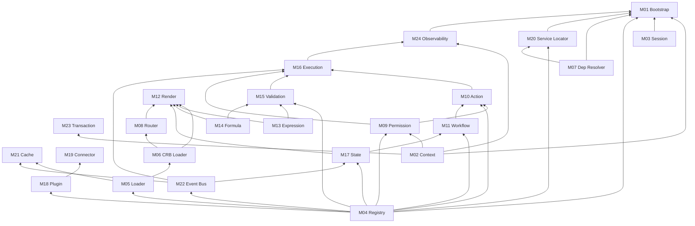

# 02 — Ordem de Implementação (DAG)

**Foundation C.0** · Dependências entre módulos — **sem ciclos**

---

## 1. Regra

Implementar na ordem topológica abaixo. Um módulo só inicia quando **todos** os predecessores têm gate PASS.

---

## 2. DAG completo



---

## 3. Fases de implementação

### Fase 0 — Fundação (C.1–C.2)

| Ordem | Módulo | Depende de |
|-------|--------|------------|
| 1 | M02 Context | — |
| 2 | M04 Registry | — |
| 3 | M07 Dependency Resolver | — |
| 4 | M24 Observability (stub) | M02 |
| 5 | M03 Session | M02 |
| 6 | M20 Service Locator | M04, M07 |
| 7 | M01 Bootstrap | M02, M03, M04, M07, M20, M24 |

### Fase 1 — Carregamento & Navegação (C.3–C.4)

| Ordem | Módulo | Depende de |
|-------|--------|------------|
| 8 | M05 Loader | M04 |
| 9 | M06 CRB Loader | M05 |
| 10 | M09 Permission | M02, M04 |
| 11 | M08 Router | M06, M09 |
| 12 | M13 Expression | M04 |
| 13 | M14 Formula | M04 |

### Fase 2 — Render & Estado (C.8–C.12)

| Ordem | Módulo | Depende de |
|-------|--------|------------|
| 14 | M22 Event Bus (stub) | M04 |
| 15 | M17 State | M04, M22 |
| 16 | M12 Render | M06, M08, M13, M14, M17 |
| 17 | M15 Validation | M04, M13, M14 |
| 18 | M11 Workflow | M04, M17 |
| 19 | M21 Cache | M05, M22 |

### Fase 3 — Execução (C.5–C.7, C.10–C.11)

| Ordem | Módulo | Depende de |
|-------|--------|------------|
| 20 | M10 Action | M04, M09, M11 |
| 21 | M16 Execution | M10, M15, M09, M22 |
| 22 | M23 Transaction | M02 |

### Fase 4 — Extensibilidade (C.13–C.14)

| Ordem | Módulo | Depende de |
|-------|--------|------------|
| 23 | M18 Plugin | M04 |
| 24 | M19 Connector | M04, M18 |

### Fase 5 — Integração Bootstrap final (C.17)

| Ordem | Módulo | Depende de |
|-------|--------|------------|
| 25 | M01 Bootstrap (RT-8 complete) | todos M02–M24 |
| 26 | M24 Observability (complete) | M16 |

---

## 4. Ordem linear recomendada (sprints)

```
M02 → M04 → M07 → M24* → M03 → M20 → M01* → M05 → M06 → M09 → M08 → M13 → M14
→ M22 → M17 → M12 → M15 → M11 → M21 → M10 → M16 → M23 → M18 → M19 → M01 → M24
```

`*` = primeira passagem parcial; segunda passagem ao fechar RT-8.

---

## 5. Validação anti-ciclo

| Check | Resultado |
|-------|-----------|
| DFS em grafo direcionado | **ACÍCLICO** |
| Bootstrap depende de todos | **CORRETO** (orquestrador final) |
| Render antes de CRB | **BLOQUEADO** (M06 precede M12) |
| Execution antes de Validation | **BLOQUEADO** (M15 precede M16) |

---

## 6. Paralelismo permitido

Estes pares podem ser implementados **em paralelo** após predecessores comuns:

| Par A | Par B | Predecessor comum |
|-------|-------|-------------------|
| M03 Session | M05 Loader | M04 |
| M13 Expression | M14 Formula | M04 |
| M08 Router | M17 State | M06, M09 |
| M18 Plugin | M23 Transaction | M04, M02 |
| M21 Cache | M15 Validation | M05/M04 |

---

*Próximo: [03-INTERFACES](./03-INTERFACES.md)*
