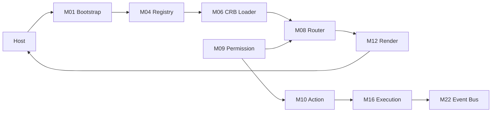

# 04 — Module Contracts

**Foundation C.0** · Contratos entre módulos do Runtime

---

## 1. Formato de contrato

Cada contrato define: **Provider → Consumer**, payload, garantias, falhas.

---

## 2. Contratos Core

### C-01: Bootstrap → Host

| Campo | Valor |
|-------|-------|
| Provider | M01 Bootstrap |
| Consumer | Host application (Vite/React shell) |
| Method | `bootstrap()` → `RuntimeInstance` |
| Guarantee | RT-8 ready or typed error; never partial silent failure |
| Failure | `MAK-L3-RUNTIME-001` maintenance screen |

### C-02: Context → All modules

| Campo | Valor |
|-------|-------|
| Provider | M02 Context |
| Consumer | M03–M24 |
| Payload | Immutable `IRuntimeContext` |
| Guarantee | `traceId` propagated; tenant isolation enforced |
| Forbidden | Mutation of context after creation |

### C-03: Session → Bootstrap / Permission

| Campo | Valor |
|-------|-------|
| Provider | M03 Session |
| Consumer | M01, M09 |
| Payload | `AccessScope` |
| Guarantee | Valid JWT or redirect to login |
| TTL | Per PA-02 session table |

### C-04: Registry → All engines

| Campo | Valor |
|-------|-------|
| Provider | M04 Registry |
| Consumer | M05–M19 |
| API | `register` / `resolve` |
| Guarantee | Type-safe factory; duplicate key throws |
| Lifecycle | Populated at RT-3; read-only post-hydrate |

### C-05: Loader → CRB Loader

| Campo | Valor |
|-------|-------|
| Provider | M05 Loader |
| Consumer | M06 |
| Payload | Raw CRB bytes/JSON |
| Guarantee | Version header preserved |
| Cache | Delegates to M21 |

### C-06: CRB Loader → Registry / Render / Router

| Campo | Valor |
|-------|-------|
| Provider | M06 CRB Loader |
| Consumer | M04, M08, M12 |
| Payload | V13–V20 registry entries |
| Guarantee | Verify RT-2 before hydrate |
| Failure | Reject unsigned / hash mismatch |

### C-07: Dependency Resolver → Service Locator

| Campo | Valor |
|-------|-------|
| Provider | M07 |
| Consumer | M20 |
| Payload | Ordered init list |
| Guarantee | Acyclic; throws on cycle |

### C-08: Router → Render Engine

| Campo | Valor |
|-------|-------|
| Provider | M08 Router |
| Consumer | M12 Render |
| Payload | `RouteMatch { screenId, layoutId, params }` |
| Precondition | M09 `canActivate` PASS |

---

## 3. Contratos Engines

### C-09: Permission → Action / Render / Router

| Campo | Valor |
|-------|-------|
| Provider | M09 Permission |
| Consumer | M08, M10, M12 |
| API | `can(action, resource, ctx)` |
| Rule | Deny > Allow > Default deny (PA-02) |

### C-10: Action → Execution

| Campo | Valor |
|-------|-------|
| Provider | M10 Action |
| Consumer | M16 Execution |
| Payload | `UecCommand` |
| Guarantee | Handler resolved from CRB action registry |

### C-11: Workflow → Action

| Campo | Valor |
|-------|-------|
| Provider | M11 Workflow |
| Consumer | M10 |
| Payload | Transition triggers bound actions |
| Persistence | BE store; FE read-only instance view |

### C-12: Render → Host UI

| Campo | Valor |
|-------|-------|
| Provider | M12 Render |
| Consumer | React host |
| Payload | `RenderTree` |
| Adapters | table, form (C); others incremental |

### C-13: Expression / Formula → Render / Validation

| Campo | Valor |
|-------|-------|
| Provider | M13, M14 |
| Consumer | M12, M15 |
| Guarantee | Read-only evaluation; no side effects |
| Reuse | G302 frozen engines via adapter (D-RI-10) |

### C-14: Validation → Execution

| Campo | Valor |
|-------|-------|
| Provider | M15 Validation |
| Consumer | M16 (pipeline stage 3) |
| Failure | Block execution; return UEC validation error |

### C-15: Execution → Event Bus

| Campo | Valor |
|-------|-------|
| Provider | M16 Execution |
| Consumer | M22 |
| Payload | Domain events post-success |
| Rule | UP-09 stage 5 emit |

### C-16: State → Render / Workflow

| Campo | Valor |
|-------|-------|
| Provider | M17 State |
| Consumer | M11, M12 |
| Scope | Route-scoped screen state; USM entity state |

### C-17: Plugin → Connector

| Campo | Valor |
|-------|-------|
| Provider | M18 Plugin |
| Consumer | M19 |
| Rule | No eval; manifest-only (D-PA-23) |

### C-18: Connector → External systems

| Campo | Valor |
|-------|-------|
| Provider | M19 Connector |
| Consumer | Handlers via M16 |
| Transport | HTTP first; DB/message stub |

---

## 4. Contratos Infra

### C-19: Service Locator → Bootstrap

| Campo | Valor |
|-------|-------|
| Provider | M20 |
| Consumer | M01 |
| Guarantee | All services resolvable after RT-3 |

### C-20: Cache → Loader / CRB / Permission

| Campo | Valor |
|-------|-------|
| Provider | M21 Cache |
| Consumer | M05, M06, M09 |
| Keys | `mmm:crb:{tenant}:{module}`, `auth:scope:{userId}` |
| Invalidation | Publish event, login/logout |

### C-21: Event Bus → Execution / State

| Campo | Valor |
|-------|-------|
| Provider | M22 (stub) |
| Consumer | M16, M17 |
| Guarantee | At-least-once in-process; F upgrades transport |

### C-22: Transaction Manager → Execution (BE)

| Campo | Valor |
|-------|-------|
| Provider | M23 |
| Consumer | M16 handlers |
| Guarantee | Rollback on failure; idempotency key honored |

### C-23: Observability → All

| Campo | Valor |
|-------|-------|
| Provider | M24 |
| Consumer | All modules |
| Guarantee | `traceId` on every log/span |

---

## 5. Contratos cross-cutting (UEP)

| Contract | SSOT | Modules |
|----------|------|---------|
| UEC shape | UP-02 | M10, M16 |
| Pipeline 5 stages | UP-09 | M16 |
| Error codes | UP-04 | All |
| Event envelope | UP-06 | M22 |
| Handler signature | UP-10 | M10, M16 |

---

## 6. Forbidden contracts

| From | To | Reason |
|------|-----|--------|
| Any Runtime module | MMM DB | D-PA-03, D-RI-13 |
| Render Engine | Generic Repository direct | Must via Action/Execution |
| Plugin Engine | `eval()` / remote script | D-PA-23 |
| Bootstrap | Business logic handlers | Orchestration only |

---

## 7. Diagrama de contratos

---

*Próximo: [05-FOLDER-STRUCTURE](./05-FOLDER-STRUCTURE.md)*
