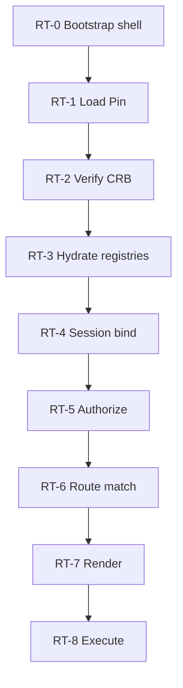
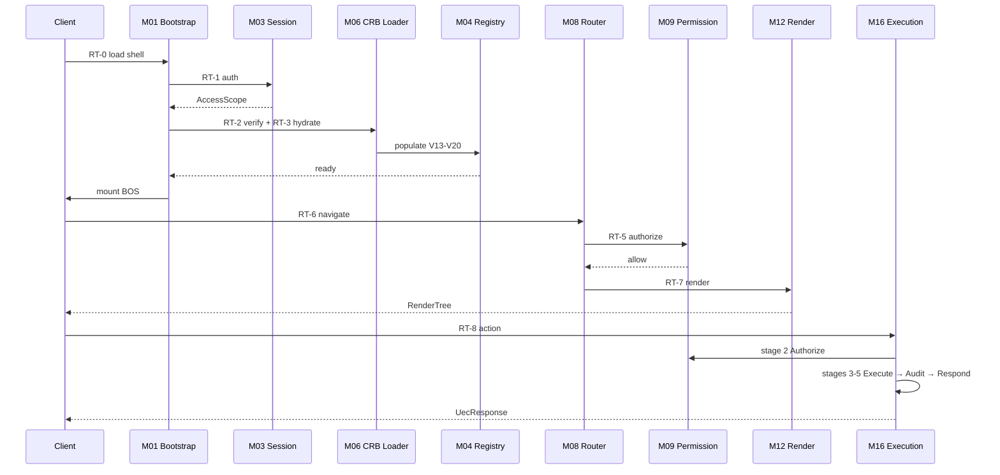

# 06 — Bootstrap Sequence

**Foundation C.0** · RT-0 → RT-8 passo a passo

**SSOT:** [PA-02](../platform-architecture/02-RUNTIME.md), [PB-07](../platform-behavior/07-RUNTIME-LIFECYCLE.md)

---

## 1. Visão geral

**RT-0 → RT-3:** once per app load (session birth).  
**RT-4 → RT-8:** per routed request / user interaction.

---

## 2. RT-0 — Bootstrap Shell

| Step | Actor | Action | Module |
|------|-------|--------|--------|
| 0.1 | Client | Load `index.html` + Vite bundle | Host |
| 0.2 | M01 | Create bootstrap context | Bootstrap |
| 0.3 | M20 | Init Service Locator (empty) | Service Locator |
| 0.4 | M24 | Start root span `runtime.bootstrap` | Observability |
| 0.5 | M02 | Create base Context (tenant unknown) | Context |

**Output:** Bootstrap context ready for auth.  
**Failure:** Maintenance page — `MAK-L3-RUNTIME-001`.

---

## 3. RT-1 — Load Pin

| Step | Action | Module |
|------|--------|--------|
| 1.1 | M03 authenticate / refresh session | Session |
| 1.2 | L1 Auth returns `AccessScope` | External L1 |
| 1.3 | M02 enrich Context with tenant, user | Context |
| 1.4 | Fetch EnvironmentPin (tenant, app, env) | Loader + Internal API |
| 1.5 | M21 cache pin `pin:{tenant}:{app}:{env}` TTL 60s | Cache |

**Output:** `bundleId`, `definitionVersionId`.  
**Failure:** Fail-closed maintenance screen.

---

## 4. RT-2 — Verify CRB

| Step | Check | Module |
|------|-------|--------|
| 2.1 | Fetch CRB payload by bundleId | M05 Loader |
| 2.2 | `crbVersion === 'mmm-crb-v1'` | M06 CRB Loader |
| 2.3 | `integrityHash` match | M06 |
| 2.4 | `signatureRef` HMAC valid (prod) | M06 |
| 2.5 | Schema version compatible | M06 |

**Output:** Verified `CrbPayload`.  
**Failure:** Reject load; alert ops — `MAK-L3-RUNTIME-002`.

---

## 5. RT-3 — Hydrate

| Step | Action | Module |
|------|--------|--------|
| 3.1 | M07 resolve dependency order | Dependency Resolver |
| 3.2 | Map CRB → V13–V20 registries | M06 + M04 |
| 3.3 | Register renderers, handlers, connectors | M04 Registry |
| 3.4 | M18 load plugin manifests (no eval) | Plugin Engine |
| 3.5 | M21 cache hydrate `mmm:crb:{tenant}:{module}` | Cache |
| 3.6 | M08 build route table | Router |

**Output:** Hydrated registries + route table.  
**Failure:** Abort on schema mismatch or circular dep.

---

## 6. RT-4 — Session Bind

| Step | Action | Module |
|------|--------|--------|
| 4.1 | Bind user, tenant, selected company | M03 Session |
| 4.2 | Attach locale, preferences | M03 |
| 4.3 | M02 finalize Context | Context |

**Per:** Each navigation refresh or company switch.

---

## 7. RT-5 — Authorize

| Step | Action | Module |
|------|--------|--------|
| 5.1 | M08 `canActivate(route, ctx)` | Router + M09 |
| 5.2 | M09 evaluate permission registry | Permission Engine |
| 5.3 | Deny > Allow > Default deny | Permission Engine |

**Failure:** 403 / hidden route — no render.

---

## 8. RT-6 — Route

| Step | Action | Module |
|------|--------|--------|
| 6.1 | Match URL → route entry | M08 Router |
| 6.2 | Resolve screenId, layoutId, params | Router |
| 6.3 | M17 init route-scoped state | State Engine |

---

## 9. RT-7 — Render

| Step | Action | Module |
|------|--------|--------|
| 7.1 | M12 select view adapter by viewMode | Render Engine |
| 7.2 | M13/M14 evaluate bindings/formulas | Expression/Formula |
| 7.3 | M09 filter visible elements | Permission Engine |
| 7.4 | Build RenderTree → React mount | Render + Host |

**Foundation C:** table + form adapters certified first (D-RI-11).

---

## 10. RT-8 — Execute

| Step | Action | Module |
|------|--------|--------|
| 8.1 | User triggers action | Host UI |
| 8.2 | M10 dispatch UEC Command/Action | Action Engine |
| 8.3 | M16 pipeline: Validate → Authorize → Execute → Audit → Respond | Execution Engine |
| 8.4 | M15 validation (stage 1) | Validation Engine |
| 8.5 | M23 transaction wrap (BE, Execute stage) | Transaction Manager |
| 8.6 | M22 publish domain events (Execute stage, post-commit) | Event Bus |
| 8.7 | M17 update state / USM transition | State + Workflow |

---

## 11. Sequence diagram (full session)

---

## 12. Rollback / hot-swap

| Event | Runtime behavior |
|-------|------------------|
| Pin change (republish) | Invalidate M21 cache → re-run RT-2→RT-3 |
| Logout | M03 destroy session → RT-0 partial |
| Permission change | Invalidate `auth:scope:{userId}` → RT-5 refresh |

---

## 13. FE vs BE split (D-RI-06)

| Phase | Frontend | Backend |
|-------|----------|---------|
| RT-0–RT-3 | Full | Pin/CRB API only |
| RT-4 | Session storage | JWT validation |
| RT-5 | UI filter | Enforcement |
| RT-7 | Render | — |
| RT-8 | Dispatch | Handlers, TX, workflow persist |

---

*Próximo: [07-DEPENDENCY-GRAPH](./07-DEPENDENCY-GRAPH.md)*
