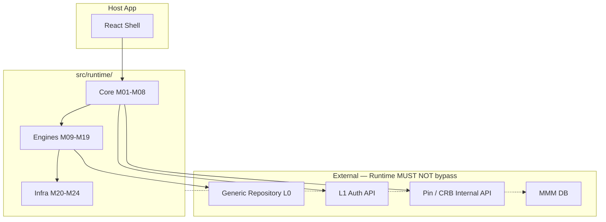

# 07 — Dependency Graph

**Foundation C.0** · Quem conhece quem — visibilidade entre módulos

---

## 1. Princípios

1. **Dependency Inversion:** engines depend on interfaces in `types/`, not concrete infra.
2. **No upward deps:** Infra never imports Engines; Core never imports Host UI.
3. **No MMM access:** No module queries MMM DB (D-RI-13).
4. **Bootstrap is orchestrator:** M01 may invoke all modules; others must not invoke M01.

---

## 2. Matriz de visibilidade

Legenda: ✅ may import · ❌ must never import · ⚡ via interface only

|  | M01 | M02 | M03 | M04 | M05 | M06 | M07 | M08 | M09 | M10 | M11 | M12 | M13 | M14 | M15 | M16 | M17 | M18 | M19 | M20 | M21 | M22 | M23 | M24 |
|--|:---:|:---:|:---:|:---:|:---:|:---:|:---:|:---:|:---:|:---:|:---:|:---:|:---:|:---:|:---:|:---:|:---:|:---:|:---:|:---:|:---:|:---:|:---:|:---:|
| **M01 Bootstrap** | — | ✅ | ✅ | ✅ | ✅ | ✅ | ✅ | ✅ | ✅ | ✅ | ✅ | ✅ | ⚡ | ⚡ | ⚡ | ✅ | ✅ | ⚡ | ⚡ | ✅ | ✅ | ✅ | ⚡ | ✅ |
| **M02 Context** | ❌ | — | ❌ | ❌ | ❌ | ❌ | ❌ | ❌ | ❌ | ❌ | ❌ | ❌ | ❌ | ❌ | ❌ | ❌ | ❌ | ❌ | ❌ | ⚡ | ❌ | ❌ | ❌ | ⚡ |
| **M03 Session** | ❌ | ✅ | — | ❌ | ❌ | ❌ | ❌ | ❌ | ⚡ | ❌ | ❌ | ❌ | ❌ | ❌ | ❌ | ❌ | ❌ | ❌ | ❌ | ⚡ | ❌ | ❌ | ❌ | ⚡ |
| **M04 Registry** | ❌ | ❌ | ❌ | — | ❌ | ❌ | ❌ | ❌ | ❌ | ❌ | ❌ | ❌ | ❌ | ❌ | ❌ | ❌ | ❌ | ❌ | ❌ | ❌ | ❌ | ❌ | ❌ | ⚡ |
| **M05 Loader** | ❌ | ⚡ | ❌ | ✅ | — | ❌ | ❌ | ❌ | ❌ | ❌ | ❌ | ❌ | ❌ | ❌ | ❌ | ❌ | ❌ | ❌ | ❌ | ⚡ | ✅ | ❌ | ❌ | ⚡ |
| **M06 CRB** | ❌ | ⚡ | ❌ | ✅ | ✅ | — | ❌ | ❌ | ❌ | ❌ | ❌ | ❌ | ❌ | ❌ | ❌ | ❌ | ❌ | ⚡ | ❌ | ⚡ | ✅ | ❌ | ❌ | ⚡ |
| **M07 DepRes** | ❌ | ❌ | ❌ | ⚡ | ❌ | ❌ | — | ❌ | ❌ | ❌ | ❌ | ❌ | ❌ | ❌ | ❌ | ❌ | ❌ | ❌ | ❌ | ⚡ | ❌ | ❌ | ❌ | ❌ |
| **M08 Router** | ❌ | ✅ | ❌ | ✅ | ❌ | ⚡ | ❌ | — | ✅ | ❌ | ❌ | ⚡ | ❌ | ❌ | ❌ | ❌ | ⚡ | ❌ | ❌ | ⚡ | ❌ | ❌ | ❌ | ⚡ |
| **M09 Permission** | ❌ | ✅ | ⚡ | ✅ | ❌ | ❌ | ❌ | ❌ | — | ❌ | ❌ | ⚡ | ❌ | ❌ | ❌ | ⚡ | ❌ | ❌ | ❌ | ⚡ | ✅ | ❌ | ❌ | ⚡ |
| **M10 Action** | ❌ | ✅ | ❌ | ✅ | ❌ | ❌ | ❌ | ❌ | ⚡ | — | ⚡ | ❌ | ❌ | ❌ | ❌ | ⚡ | ❌ | ❌ | ❌ | ⚡ | ❌ | ⚡ | ❌ | ⚡ |
| **M11 Workflow** | ❌ | ✅ | ❌ | ✅ | ❌ | ❌ | ❌ | ❌ | ❌ | ❌ | — | ❌ | ❌ | ❌ | ❌ | ⚡ | ✅ | ❌ | ❌ | ⚡ | ❌ | ⚡ | ⚡ | ⚡ |
| **M12 Render** | ❌ | ✅ | ❌ | ✅ | ❌ | ⚡ | ❌ | ⚡ | ⚡ | ❌ | ❌ | — | ✅ | ✅ | ❌ | ❌ | ✅ | ❌ | ❌ | ⚡ | ❌ | ❌ | ❌ | ⚡ |
| **M13 Expression** | ❌ | ❌ | ❌ | ⚡ | ❌ | ❌ | ❌ | ❌ | ❌ | ❌ | ❌ | ❌ | — | ❌ | ❌ | ❌ | ❌ | ❌ | ❌ | ❌ | ❌ | ❌ | ❌ | ❌ |
| **M14 Formula** | ❌ | ❌ | ❌ | ⚡ | ❌ | ❌ | ❌ | ❌ | ❌ | ❌ | ❌ | ❌ | ❌ | — | ❌ | ❌ | ❌ | ❌ | ❌ | ❌ | ❌ | ❌ | ❌ | ❌ |
| **M15 Validation** | ❌ | ✅ | ❌ | ✅ | ❌ | ❌ | ❌ | ❌ | ❌ | ❌ | ❌ | ❌ | ✅ | ✅ | — | ❌ | ❌ | ❌ | ❌ | ⚡ | ❌ | ❌ | ❌ | ⚡ |
| **M16 Execution** | ❌ | ✅ | ❌ | ✅ | ❌ | ❌ | ❌ | ❌ | ✅ | ✅ | ⚡ | ❌ | ❌ | ❌ | ✅ | — | ❌ | ❌ | ⚡ | ⚡ | ❌ | ✅ | ⚡ | ✅ |
| **M17 State** | ❌ | ✅ | ❌ | ✅ | ❌ | ❌ | ❌ | ❌ | ❌ | ❌ | ⚡ | ❌ | ❌ | ❌ | ❌ | ❌ | — | ❌ | ❌ | ⚡ | ❌ | ✅ | ❌ | ⚡ |
| **M18 Plugin** | ❌ | ❌ | ❌ | ✅ | ❌ | ❌ | ❌ | ❌ | ❌ | ❌ | ❌ | ❌ | ❌ | ❌ | ❌ | ❌ | ❌ | — | ⚡ | ⚡ | ❌ | ❌ | ❌ | ⚡ |
| **M19 Connector** | ❌ | ✅ | ❌ | ✅ | ❌ | ❌ | ❌ | ❌ | ❌ | ❌ | ❌ | ❌ | ❌ | ❌ | ❌ | ❌ | ❌ | ⚡ | — | ⚡ | ❌ | ❌ | ❌ | ⚡ |
| **M20 SvcLoc** | ❌ | ❌ | ❌ | ✅ | ❌ | ❌ | ✅ | ❌ | ❌ | ❌ | ❌ | ❌ | ❌ | ❌ | ❌ | ❌ | ❌ | ❌ | ❌ | — | ❌ | ❌ | ❌ | ❌ |
| **M21 Cache** | ❌ | ❌ | ❌ | ❌ | ❌ | ❌ | ❌ | ❌ | ❌ | ❌ | ❌ | ❌ | ❌ | ❌ | ❌ | ❌ | ❌ | ❌ | ❌ | ⚡ | — | ⚡ | ❌ | ⚡ |
| **M22 EventBus** | ❌ | ✅ | ❌ | ❌ | ❌ | ❌ | ❌ | ❌ | ❌ | ❌ | ❌ | ❌ | ❌ | ❌ | ❌ | ❌ | ❌ | ❌ | ❌ | ⚡ | ❌ | — | ❌ | ⚡ |
| **M23 Transaction** | ❌ | ✅ | ❌ | ❌ | ❌ | ❌ | ❌ | ❌ | ❌ | ❌ | ❌ | ❌ | ❌ | ❌ | ❌ | ❌ | ❌ | ❌ | ❌ | ⚡ | ❌ | ❌ | — | ⚡ |
| **M24 Observ** | ❌ | ⚡ | ❌ | ❌ | ❌ | ❌ | ❌ | ❌ | ❌ | ❌ | ❌ | ❌ | ❌ | ❌ | ❌ | ❌ | ❌ | ❌ | ❌ | ❌ | ❌ | ❌ | ❌ | — |

---

## 3. Camadas — quem nunca conhece quem

### Core (M01–M08) NEVER imports:

| Forbidden target | Reason |
|------------------|--------|
| `host/react/*` | UI is consumer, not dependency |
| `engines/render/adapters/*` concrete | Use IRenderEngine via locator |
| MMM / Prisma | D-RI-13 |
| Legacy `framework/mak` directly | Only via `adapters/legacy-runtime/` |

### Engines NEVER import:

| Forbidden target | Reason |
|------------------|--------|
| Other engine concrete classes | Cross-engine via M16 or Event Bus |
| Bootstrap (M01) | No circular orchestration |
| Host UI components | Render tree is output, not input |

### Infra NEVER imports:

| Forbidden target | Reason |
|------------------|--------|
| Any Engine implementation | Infra is leaf layer |
| Bootstrap | |

---

## 4. External boundaries

---

## 5. Allowed communication patterns

| Pattern | Example | OK? |
|---------|---------|-----|
| Direct interface call | M12 → M13.evaluate | ✅ |
| Service Locator resolve | M16 → locate(M09) | ✅ |
| Event Bus pub/sub | M16 → M22 → M17 | ✅ |
| Concrete cross-engine | M12 imports actionEngine.ts | ❌ |
| Direct GR from Render | M12 → Prisma | ❌ |
| Bootstrap in handler | M10 → bootstrap() | ❌ |

---

## 6. Lint enforcement (implementation)

Gate G423 includes ESLint `import/no-restricted-paths` rules mirroring this graph. Config location: `eslint.config.js` zone `src/runtime/`.

---

*Próximo: [08-DONE-CRITERIA](./08-DONE-CRITERIA.md)*
