# 09 — Foundation C Gates

**Foundation C.0** · Gates G423-01 through G423-24 + master G423

> D-RI-05: Sub-gates **G423-NN**. Master **G423** = Foundation C complete. **G424 remains Studio** — do not renumber.

---

## 1. Gate hierarchy

```mermaid
flowchart TB
  G423[G423 Foundation C Complete]
  G423 --> G01[G423-01 Bootstrap]
  G423 --> G02[G423-02 Context]
  G423 --> G03[G423-03 Session]
  G423 --> G04[G423-04 Registry]
  G423 --> G05[G423-05 Loader]
  G423 --> G06[G423-06 CRB Loader]
  G423 --> G07[G423-07 Dep Resolver]
  G423 --> G08[G423-08 Router]
  G423 --> G09[G423-09 Permission]
  G423 --> G10[G423-10 Action]
  G423 --> G11[G423-11 Workflow]
  G423 --> G12[G423-12 Render]
  G423 --> G13[G423-13 Expression]
  G423 --> G14[G423-14 Formula]
  G423 --> G15[G423-15 Validation]
  G423 --> G16[G423-16 Execution]
  G423 --> G17[G423-17 State]
  G423 --> G18[G423-18 Plugin]
  G423 --> G19[G423-19 Connector]
  G423 --> G20[G423-20 Service Locator]
  G423 --> G21[G423-21 Cache]
  G423 --> G22[G423-22 Event Bus]
  G423 --> G23[G423-23 Transaction]
  G423 --> G24[G423-24 Observability]
```



---

## 2. Gate registry

| Gate | Module | Script | Slice | Blocker for |
|------|--------|--------|-------|-------------|
| **G423-01** | M01 Bootstrap | `gate:g423-01` | C.1 | All RT phases |
| **G423-02** | M02 Context | `gate:g423-02` | C.1 | M01, M09 |
| **G423-03** | M03 Session | `gate:g423-03` | C.2 | M01 RT-1 |
| **G423-04** | M04 Registry | `gate:g423-04` | C.2 | M05–M19 |
| **G423-05** | M05 Loader | `gate:g423-05` | C.3 | M06 |
| **G423-06** | M06 CRB Loader | `gate:g423-06` | C.3 | M08, M12 |
| **G423-07** | M07 Dep Resolver | `gate:g423-07` | C.4 | M20 |
| **G423-08** | M08 Router | `gate:g423-08` | C.4 | M12 |
| **G423-09** | M09 Permission | `gate:g423-09` | C.5 | M10, M16 |
| **G423-10** | M10 Action | `gate:g423-10` | C.6 | M16 |
| **G423-11** | M11 Workflow | `gate:g423-11` | C.7 | M10 |
| **G423-12** | M12 Render | `gate:g423-12` | C.8 | RT-7 |
| **G423-13** | M13 Expression | `gate:g423-13` | C.9 | M12, M15 |
| **G423-14** | M14 Formula | `gate:g423-14` | C.9 | M12, M15 |
| **G423-15** | M15 Validation | `gate:g423-15` | C.10 | M16 |
| **G423-16** | M16 Execution | `gate:g423-16` | C.11 | RT-8 |
| **G423-17** | M17 State | `gate:g423-17` | C.12 | M11, M12 |
| **G423-18** | M18 Plugin | `gate:g423-18` | C.13 | M19 |
| **G423-19** | M19 Connector | `gate:g423-19` | C.14 | Handlers |
| **G423-20** | M20 Service Locator | `gate:g423-20` | C.5 | M01 complete |
| **G423-21** | M21 Cache | `gate:g423-21` | C.15 | M05, M09 |
| **G423-22** | M22 Event Bus | `gate:g423-22` | C.15 | M16 |
| **G423-23** | M23 Transaction | `gate:g423-23` | C.16 | BE RT-8 |
| **G423-24** | M24 Observability | `gate:g423-24` | C.17 | All |
| **G423** | Foundation C | `gate:g423` | C.17 | G424 Studio |

---

## 3. Gate execution rules

1. **Order:** Respect [02-IMPLEMENTATION-ORDER](./02-IMPLEMENTATION-ORDER.md) — gate N requires predecessor gates PASS.
2. **Merge block:** PR touching `src/runtime/{module}/` requires corresponding G423-NN green in CI.
3. **Master G423:** Runs full RT-0→RT-8 E2E + all sub-gates.
4. **Scripts location (implementation):** `scripts/gates/g423-*.js` — to be created in Foundation C code phase.

---

## 4. Gate vs Foundation roadmap

| Gate | Foundation | Notes |
|------|------------|-------|
| G423-NN | C (Runtime) | This document |
| G423 | C complete | Unblocks Studio G424 |
| G424 | D (Studio) | Unchanged |
| G426 | F (Event Bus prod) | Replaces M22 stub transport |

---

## 5. CI integration (planned)

```yaml
# .github/workflows — excerpt (implementation phase)
- run: npm run gate:g423-01  # per PR scope
- run: npm run gate:g423     # on Foundation C milestone branch
```

Master aggregator:

```
npm run gate:g423  →  runs g423-01..24 + E2E
```

---

## 6. Gate evidence

Each gate stores evidence in `docs/evidence/g423-{NN}/`:

| Artifact | Required |
|----------|----------|
| Test output | ✅ |
| Coverage report | ✅ |
| Done criteria checklist | ✅ |
| Dependency graph lint | ✅ (from G423-07 onward) |

---

*Próximo: [10-DELIVERY-PLANNING](./10-DELIVERY-PLANNING.md)*
