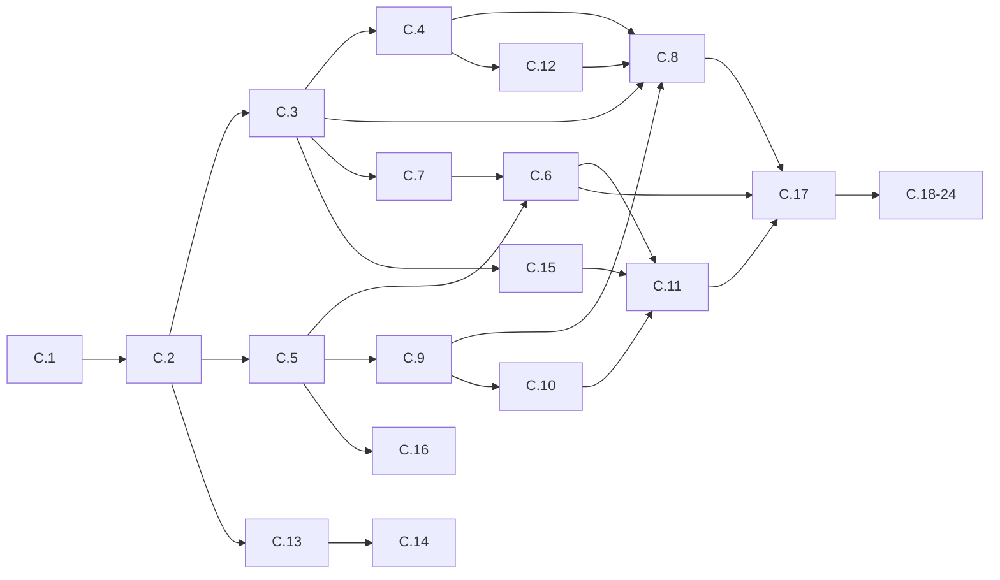

# 10 — Delivery Planning

**Foundation C.0** · Entregas pequenas (slices C.1–C.24)

> D-RI-09: Slices, not new Program IDs. Each slice ≤ one focused implementation unit. No calendar estimates — scope only.

---

## 1. Slice overview

| Slice | Modules | Gates | Deliverable |
|-------|---------|-------|-------------|
| **C.1** | M02, M01 (partial) | G423-02, G423-01* | Context + bootstrap shell RT-0 |
| **C.2** | M04, M03 | G423-04, G423-03 | Registry + Session auth flow |
| **C.3** | M05, M06 | G423-05, G423-06 | Loader + CRB verify/hydrate RT-1→RT-3 |
| **C.4** | M07, M08 | G423-07, G423-08 | Dependency resolver + Router |
| **C.5** | M20, M09 | G423-20, G423-09 | Service Locator + Permission |
| **C.6** | M10 | G423-10 | Action Engine + UEC dispatch |
| **C.7** | M11 | G423-11 | Workflow instance host |
| **C.8** | M12 (table) | G423-12* | Table view adapter |
| **C.9** | M13, M14 | G423-13, G423-14 | Expression + Formula adapters |
| **C.10** | M15 | G423-15 | Validation Engine |
| **C.11** | M16 | G423-16 | Execution pipeline (UP-09) |
| **C.12** | M17 | G423-17 | State Engine + USM |
| **C.13** | M18 | G423-18 | Plugin Engine |
| **C.14** | M19 | G423-19 | Connector Engine (HTTP) |
| **C.15** | M21, M22 | G423-21, G423-22 | Cache + Event Bus stub |
| **C.16** | M23 | G423-23 | Transaction Manager (BE) |
| **C.17** | M01, M24, M12 (form) | G423-01, G423-24, G423-12 | RT-8 complete + form adapter + **G423** |
| **C.18–C.24** | M12 (7 view modes) | G423-12 ext | Kanban, calendar, chart, etc. (non-blocking G423) |

`*` partial gate — completed in later slice.

---

## 2. Slice detail

### C.1 — Bootstrap shell

**Scope:**
- Create `src/runtime/` skeleton per [05-FOLDER-STRUCTURE](./05-FOLDER-STRUCTURE.md)
- Implement M02 Context
- M01 RT-0 only (shell load, empty locator)

**Exit:** App loads maintenance-ready bootstrap; gate G423-02 PASS.

---

### C.2 — Registry + Session

**Scope:**
- M04 Registry with all types
- M03 Session FE (mock L1)

**Exit:** Auth populates AccessScope; registry accepts factories.

---

### C.3 — CRB path

**Scope:**
- M05 fetch CRB via Internal API
- M06 verify + hydrate V13–V20

**Exit:** Fixture CRB hydrates registries; RT-2 rejects bad signature.

---

### C.4 — Navigation

**Scope:**
- M07 topological sort
- M08 route match + guards stub

**Exit:** URL resolves to screenId from CRB routes.

---

### C.5 — DI + Permission

**Scope:**
- M20 wire all core services
- M09 permission matrix from CRB

**Exit:** Unauthorized route blocked at RT-5.

---

### C.6 — Actions

**Scope:**
- M10 handler registry + UEC command dispatch

**Exit:** CRB action triggers handler; UEC response returned.

---

### C.7 — Workflow

**Scope:**
- M11 start/transition + BE persistence stub

**Exit:** Workflow instance survives page refresh (BE).

---

### C.8 — Table render

**Scope:**
- M12 table adapter
- Migrate empresas list view

**Exit:** CRB-driven table renders with permission filter.

---

### C.9 — Expression / Formula

**Scope:**
- M13/M14 G302 adapters

**Exit:** Field bindings evaluate in render.

---

### C.10 — Validation

**Scope:**
- M15 sync + async rules

**Exit:** Invalid save blocked before execution.

---

### C.11 — Execution pipeline

**Scope:**
- M16 full UP-09 5 stages

**Exit:** Integration test: command → validation → execute → event.

---

### C.12 — State

**Scope:**
- M17 screen + USM state

**Exit:** Route state isolated; USM transition works.

---

### C.13 — Plugins

**Scope:**
- M18 manifest loader

**Exit:** Plugin registers extension point without eval.

---

### C.14 — Connectors

**Scope:**
- M19 HTTP connector

**Exit:** Handler invokes external HTTP via connector.

---

### C.15 — Cache + Events

**Scope:**
- M21 CRB/scope cache
- M22 in-process bus

**Exit:** Publish invalidates cache; events reach subscriber.

---

### C.16 — Transactions

**Scope:**
- M23 Prisma transaction wrapper (BE)

**Exit:** Failed handler rolls back; idempotency works.

---

### C.17 — Foundation C milestone

**Scope:**
- M01 complete RT-0→RT-8
- M12 form adapter
- M24 observability complete
- Legacy bridge for empresas/cadcps
- **Master gate G423**

**Exit:** Full empresas CRB path without boot cache SSOT.

---

### C.18–C.24 — Additional view modes (post-G423)

| Slice | View mode |
|-------|-----------|
| C.18 | kanban |
| C.19 | calendar |
| C.20 | chart |
| C.21 | map |
| C.22 | timeline |
| C.23 | card/grid |
| C.24 | embedded/widget |

Non-blocking for G423 per D-RI-11.

---

## 3. Dependency between slices

---

## 4. Parallel tracks (optional)

After **C.5**, teams may parallelize:

| Track A | Track B |
|---------|---------|
| C.6 → C.11 | C.8 → C.9 |
| C.7 | C.12 |
| C.13 → C.14 | C.15 |

Merge conflicts resolved at C.17 integration.

---

## 5. Definition of slice done

- [ ] All module done criteria for slice gates PASS
- [ ] No new architecture / SSOT changes
- [ ] Evidence folder updated
- [ ] PR merged to `main` with gate green

---

*Próximo: [11-RISKS](./11-RISKS.md)*
