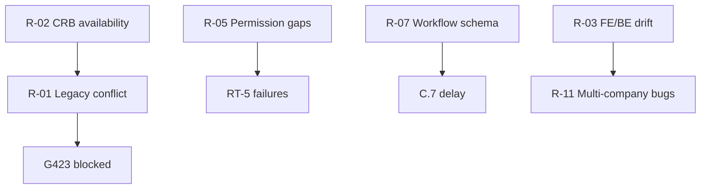

# 11 — Risks and Mitigations

**Foundation C.0** · Riscos técnicos da implementação do Runtime

---

## 1. Risk register

| ID | Risk | Impact | Likelihood | Mitigation |
|----|------|--------|------------|------------|
| R-01 | **Legacy boot cache conflict** — `generatedModules.json` / boot cache still used as SSOT | High | High | G423-20 legacy adapter; empresas path via CRB in C.17; eliminate in Foundation E |
| R-02 | **CRB not published for all modules** — only empresas has production CRB | High | Medium | Cadastro bridge (D-RI-07); scope G423 to empresas + cadcps; other modules stay transitional |
| R-03 | **FE/BE runtime split complexity** — shared types drift | Medium | Medium | Single `src/runtime/types/` package; BE imports types only; CI typecheck both |
| R-04 | **G302 engine adapter mismatch** — expression/formula API differs | Medium | Low | Adapter layer in M13/M14; contract tests against G302 fixtures |
| R-05 | **Permission model incomplete in CRB** — gaps vs L1 PermissaoEmpresa | High | Medium | M09 fail-closed default deny; bridge to L1 scope until CRB permissions complete |
| R-06 | **Event Bus stub insufficient** — handlers expect async delivery | Medium | Medium | Document stub semantics; queue in-memory; Foundation F replaces transport (D-RI-08) |
| R-07 | **Workflow persistence schema** — no Prisma model yet | Medium | Medium | Minimal workflow_instance table in C.7; align with PB-05 before merge |
| R-08 | **Render adapter explosion** — 11 view modes delay C | Medium | High | D-RI-11: table + form only for G423; C.18–C.24 incremental |
| R-09 | **Circular dependency in module imports** — devs bypass graph | High | Medium | ESLint `import/no-restricted-paths` from [07-DEPENDENCY-GRAPH](./07-DEPENDENCY-GRAPH.md); gate G423-07 |
| R-10 | **Internal API instability** — Pin/CRB endpoints change | High | Low | Contract tests against Railway staging; version pin in loader |
| R-11 | **Multi-company scope bugs** — acesso_global vs PermissaoEmpresa | High | Medium | RT-5 test matrix; PB-07 session rules in E2E |
| R-12 | **Redis unavailable locally** — cache falls back | Low | Medium | MemoryCache default; Redis optional in dev |
| R-13 | **Signature verification keys** — prod HMAC keys not in dev | Medium | Medium | Dev mode skip with explicit flag; prod mandatory RT-2 |
| R-14 | **Parallel slice merge conflicts** — C.6/C.8/C.13 parallel | Medium | Medium | C.17 integration slice; shared types frozen after C.5 |
| R-15 | **MMM DB temptation** — shortcuts querying Prisma from Runtime | High | Low | D-RI-13 lint rule; code review checklist; gate G423 audits imports |

---

## 2. Critical path risks

**Critical path:** C.3 (CRB) → C.8 (Render) → C.11 (Execution) → C.17 (G423).

---

## 3. Mitigation by phase

### Phase 0 (C.1–C.2)
- Establish folder structure early (R-09)
- Mock L1 auth — no prod dependency (R-10)

### Phase 1 (C.3–C.4)
- Fixture CRB in repo for tests (R-02)
- Dev signature bypass flag documented (R-13)

### Phase 2 (C.5–C.12)
- Fail-closed permissions (R-05)
- G302 adapter tests (R-04)

### Phase 3 (C.13–C.17)
- Legacy bridge only for unmigrated modules (R-01)
- C.17 integration before G423 (R-14)

---

## 4. Escalation triggers

| Trigger | Action |
|---------|--------|
| G423-06 fails 2 sprints | Review CRB publish pipeline with MMM team |
| RT-5 false negatives | Audit CRB permission registry vs L1 |
| Import lint violations | Block merge; refactor before next slice |
| E2E empresas fails at C.17 | Delay G423; do not waive |

---

## 5. Accepted risks (defer)

| Risk | Deferred to |
|------|-------------|
| Production Event Bus | Foundation F (G426) |
| Full Generic Repository | Foundation G |
| Scheduler / timers in workflow | Foundation F |
| All 11 view modes | C.18–C.24 post-G423 |
| Boot cache elimination | Foundation E |

---

*Próximo: [12-AUDITORIA-FINAL](./12-AUDITORIA-FINAL.md)*
